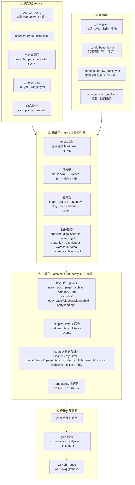

# 项目架构说明

> 本项目是一个基于 **Hexo 6.3** 的博客站点，使用 **Fomalhaut 主题**（由 **Butterfly 4.3.1** 深度魔改而来，采用 Pug 模板 + Stylus 样式 + Hexo 扩展脚本）。
> 可视化架构图见 [architecture.svg](./architecture.svg)（浏览器直接打开）。

## 架构总览（Mermaid）



## 分层详解

### ① 内容层（source/）
| 目录 | 作用 |
| --- | --- |
| `_posts/` | 博客文章（Markdown，`YYYY-MM-DD-标题.md`） |
| `_drafts/` | 草稿（`render_drafts: false`，默认不发布） |
| `_data/` | 数据文件：`link.yml`（友链）、`widget.yml`（侧栏自定义） |
| `box/ · life/ · personal/ · site/ · social/` | 自定义页面：导航、画廊、音乐/电影/游戏、关于、说说、统计（ECharts）、友链等 |
| `css/ · js/ · img/ · assets/` | 站点自定义静态资源（fomal.js、coin.js、kslink.js 等） |
| `scaffolds/` | `hexo new` 新建文章/页面/草稿的模板 |

### ② 配置层
- `_config.yml`：Hexo 站点主配置 —— 站点信息、URL（`permalink: posts/:abbrlink.html`）、渲染器、生成器、插件开关（swiper/gitcalendar/search/feed/sitemap/baidu）、部署目标（GitHub Pages）。
- `_config.butterfly.yml`：主题用户级配置（覆盖主题默认值，Butterfly 官方推荐方式）。
- `themes/butterfly/_config.yml`：主题完整配置（109+ 配置项：菜单、评论系统、CDN、注入、暗色模式等）。
- `package.json` / `gulpfile.js`：30+ 依赖包与构建后压缩任务。

### ③ 构建层（Hexo 渲染引擎）
- **渲染器**：Markdown（markdown-it + kramed + markdown-it-plus 外挂标签）→ Pug 模板 / Stylus 样式。
- **生成器**：首页、归档、分类、标签、RSS（feed）、站点地图（sitemap/baidusitemap）、本地搜索（search.xml）。
- **插件生态**（hexo 插件体系）：`hexo-abbrlink`（短链接）、`hexo-algoliasearch`（全文搜索）、`hexo-blog-encrypt`（加密文章）、`hexo-butterfly-*` 系列（swiper 轮播 / envelope 信封 / wowjs 动效 / categories-card 分类卡片 / clock 时钟 / tag-plugins-plus 标签）、`hexo-filter-gitcalendar`（GitHub 提交日历）、`hexo-wordcount-fomal`（字数统计）、`hexo-magnet-fomal`（分类磁贴）、`hexo-tag-aplayer`（音乐）、`hexo-pdf` 等。

### ④ 主题层（themes/butterfly）
- **layout/**（Pug 模板）：入口 `index.pug / post.pug / page.pug / archive.pug / category.pug / tag.pug`，公共骨架 `includes/layout.pug`（head → body → sidebar → header → content → footer → rightside → 搜索/右键菜单），子模块含 `head/ header/ widget/ page/ post/ third-party/ loading/ mixins/ custom/`。
- **scripts/**（Hexo 扩展点，通过 `hexo.extend.*` 注册）：
  - `events/`：`init.js`（版本校验）、`stylus.js`（Stylus 变量注入）、`cdn.js`、`comment.js`、`404.js`、`welcome.js`
  - `helpers/`：`page.js`（page_description/cloudTags）、`hexo_echarts.js`（文章/标签/分类统计图）、`inject_head_js.js`（暗色模式/本地存储）、`aside_archives.js`、`aside_categories.js`、`related_post.js` 等
  - `filters/`：`post_lazyload.js`（图片懒加载）、`random_cover.js`（随机封面）
  - `tag/`：button、flink（友链）、gallery、hide、inlineImg、label、mermaid、note、tabs、timeline 等外挂标签
- **source/**：`css/index.styl` 为样式总入口（按模块 `_global/_layout/_page/_tags/_mode/_highlight/_search/_custom` 拆分 + 按配置条件加载搜索样式），前端脚本 `js/main.js`、`js/utils.js`、`js/search/*`，图片 `img/`。
- **languages/**：zh-CN / en / zh-TW / default 四套语言包。

### ⑤ 产物与部署层
1. `hexo generate` 渲染全部页面到 `public/`；
2. `gulp` 并行执行 JS 压缩（terser）、CSS 压缩（clean-css）、HTML 压缩（htmlmin/htmlclean）；
3. `hexo deploy` 通过 `hexo-deployer-git` 推送到 GitHub Pages（ATRIqwq.github.io，分支 main）；
4. 外部服务：CDN（jsdelivr/elemecdn）、评论系统（giscus/twikoo/waline 等可选）、站点统计（busuanzi/百度/谷歌）、Algolia/本地搜索、百度收录推送、RSS 订阅。

## 常用命令
```bash
hexo clean      # 清理缓存与 public/
hexo generate   # 构建静态站点（npm run build）
hexo server     # 本地预览 http://localhost:4000（npm run server）
gulp            # 压缩 public/ 中的 JS/CSS/HTML
hexo deploy     # 发布到 GitHub Pages（npm run deploy）
```
